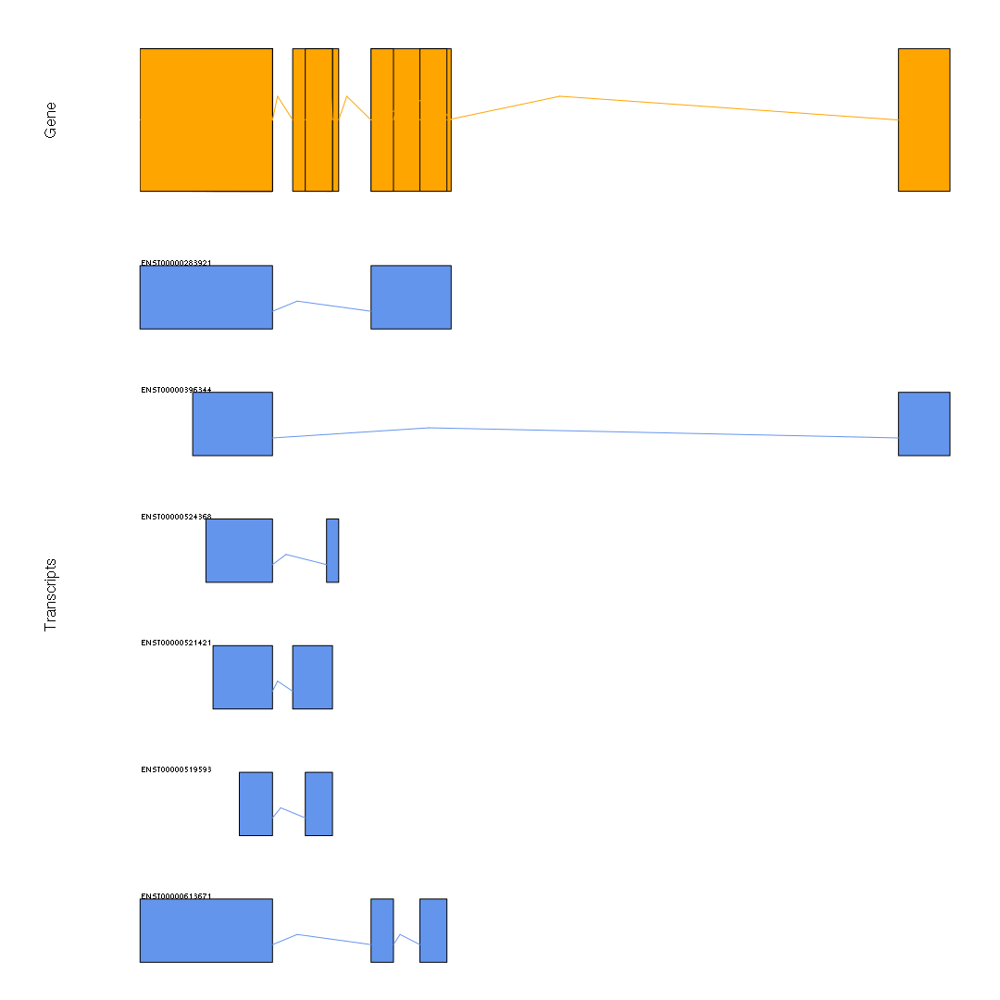

Querying transcript length using Bioconductor

Overview
========

The goal of this analysis is to explore how Bioconductor handles transcript length. This is motivated by the realization that the functions which generate transcript database packages (e.g. `makeTxDbFromGFF`) result in different numbers for "transcript length" for intron-containing genes, compared with what is listed in the annotation TriTrypDB text files for the same gene.

For example, currently, the transcript length that gets computed uses the gene/transcript boundaries for [LmjF.02.0100](http://www.genedb.org/gene/LmjF.02.0100?actionName=%2FQuery%2FquickSearch&resultsSize=1&taxonNodeName=Root) which has the gene model:

    TABLE: Gene Model
    [Name]          [Type]  [Start] [End]   [Is Reversed]
    LmjF.02.0100    exon    35740   36189   1
    LmjF.02.0100    intron  35739   35739   1
    LmjF.02.0100    exon    34455   35738   1
    LmjF.02.0100    intron  34447   34454   1
    LmjF.02.0100    exon    33424   34446   1

The correct transcript length should be:

    > (36189-35740+1) + (35738-34455+1) + (34446-33424+1)
    [1] 2757

Which is what is listed in the annotation txt file (TriTrypDB-9.0\_LmajorFriedlinGene.txt). However, the TxDb generation logic does not account for introns and instead arrives at:

    > 36189 - 33424 + 1
    [1] 2766

This is a result of using the `useGenesAsTranscripts=TRUE` parameter in `makeTranscriptDbFromGFF()` (Bioconductor 3.0) or `gffTxName="gene"` parameter in `makeTxDbFromGFF()` (Bioconductor 3.1) to avoid excluding ncRNAs which do not have an `mRNA` row in the source GFF files.

**TriTrypDB-9.0\_LmajorFriedlin\_genes.gff**

    LmjF.02 TriTrypDB   gene    33424   36189   .   -   .   ID=LmjF.02.0100;Name=LmjF.02.0100;description=hypothetical+protein%2C+conserved+%28pseudogene%29;size=2766;web_id=LmjF.02.0100;locus_tag=LmjF.02.0100;size=2766;Alias=LmjF2.0100,LmjF02.0100,LmjF.02.0100,LmjF02.0100:pseudogenic_transcript,LmjF.02.0100:pseudogenic.transcript,LmjF02.0100:pseudogenic_transcript:pep,LmjF.02.0100:pseudogenic.transcript:pep
    LmjF.02 TriTrypDB   mRNA    33424   36189   .   -   .   ID=rna_LmjF.02.0100-1;Name=LmjF.02.0100-1;description=LmjF.02.0100-1;size=2766;Parent=LmjF.02.0100;Ontology_term=GO:0003676,GO:0008270;Dbxref=ApiDB:LmjF.02.0100,taxon:347515
    LmjF.02 TriTrypDB   CDS 33424   34446   .   -   0   ID=cds_LmjF.02.0100-3;Name=cds;description=.;size=1023;Parent=rna_LmjF.02.0100-1
    LmjF.02 TriTrypDB   CDS 34455   35738   .   -   0   ID=cds_LmjF.02.0100-2;Name=cds;description=.;size=1284;Parent=rna_LmjF.02.0100-1
    LmjF.02 TriTrypDB   CDS 35740   36189   .   -   0   ID=cds_LmjF.02.0100-1;Name=cds;description=.;size=450;Parent=rna_LmjF.02.0100-1
    LmjF.02 TriTrypDB   exon    35740   36189   .   -   .   ID=exon_LmjF.02.0100-1;Name=exon;description=exon;size=450;Parent=rna_LmjF.02.0100-1
    LmjF.02 TriTrypDB   exon    34455   35738   .   -   .   ID=exon_LmjF.02.0100-2;Name=exon;description=exon;size=1284;Parent=rna_LmjF.02.0100-1
    LmjF.02 TriTrypDB   exon    33424   34446   .   -   .   ID=exon_LmjF.02.0100-3;Name=exon;description=exon;size=1023;Parent=rna_LmjF.02.0100-1

*L. major* genes that are likely affected (i.e. contain introns):

``` r
library("rtracklayer")

# load gff
lmajor_gff_filepath = file.path(Sys.getenv('REF'), 'lmajor_friedlin', 
                                'annotation', 'TriTrypDB-27_LmajorFriedlin.gff')
lmajor_gff = import.gff3(lmajor_gff_filepath)

# get exons
lmajor_exons = lmajor_gff[lmajor_gff$type == 'exon']

# find genes with more than one exon
multiexons = substring(lmajor_exons[grepl('-2$', lmajor_exons$ID)]$ID, 6, 17)
print(multiexons)
```

    ##  [1] "LmjF.02.0100" "LmjF.02.0440" "LmjF.03.0290" "LmjF.04.1165"
    ##  [5] "LmjF.05.1160" "LmjF.06.0400" "LmjF.07.0340" "LmjF.07.0745"
    ##  [9] "LmjF.07.1105" "LmjF.08.0135" "LmjF.08.0795" "LmjF.08.0805"
    ## [13] "LmjF.10.0350" "LmjF.10.1081" "LmjF.11.0570" "LmjF.11.1230"
    ## [17] "LmjF.11.1260" "LmjF.14.0020" "LmjF.14.0870" "LmjF.15.0440"
    ## [21] "LmjF.16.1385" "LmjF.17.0180" "LmjF.21.0791" "LmjF.22.0130"
    ## [25] "LmjF.22.0340" "LmjF.22.1680" "LmjF.23.0410" "LmjF.23.0845"
    ## [29] "LmjF.23.0910" "LmjF.23.1405" "LmjF.25.1230" "LmjF.25.2380"
    ## [33] "LmjF.26.0450" "LmjF.26.0520" "LmjF.26.2495" "LmjF.27.1245"
    ## [37] "LmjF.27.1710" "LmjF.28.1165" "LmjF.28.2965" "LmjF.29.1080"
    ## [41] "LmjF.29.2600" "LmjF.30.0190" "LmjF.30.2500" "LmjF.31.1440"
    ## [45] "LmjF.31.2195" "LmjF.31.3035" "LmjF.33.0115" "LmjF.33.2905"
    ## [49] "LmjF.33.3110" "LmjF.35.0015" "LmjF.35.2725" "LmjF.36.0325"
    ## [53] "LmjF.36.1395" "LmjF.36.5595" "LmjF.36.6785"

*T. cruzi* genes that are likely affected (i.e. contain introns):

``` r
# load gff
tcruzi_gff_filepath = file.path(Sys.getenv('REF'), 'tcruzi_clbrener_esmeraldo-like/annotation', 
                                'TriTrypDB-27_TcruziCLBrenerEsmeraldo-like.gff')
tcruzi_gff = import.gff3(tcruzi_gff_filepath)

# get exons
tcruzi_exons = tcruzi_gff[tcruzi_gff$type == 'exon']

# find genes with more than one exon
multiexons = substring(tcruzi_exons[grepl('-2$', tcruzi_exons$ID)]$ID, 6)
print(multiexons)
```

    ## [1] "TcCLB.506677.39-2"  "TcCLB.508347.159-2" "TcCLB.508973.50-2" 
    ## [4] "TcCLB.511537.8-2"

Finally, it appears that what goseq calls "gene length" is the median of all transcripts for a gene. From the goseq vignette:

> Once you have a transcriptDb object, you can get a vector named by gene ID containing the median transcript length of each gene simply by using the command.
>
> > txsByGene=transcriptsBy(txdb,"gene")
>
> > lengthData=median(width(txsByGene))

Methods
=======

L. major
--------

First, let's look at what information is available for the generated *L. major* transcript databases.

**Note 2015/02/21**:

Tested both Bioconductor 3.0 and 3.1 (devel), using either the default arguments for `makeTranscriptDbFromGFF` / `makeTxDbFromGFF`, or by specifying either 'gffTxName="gene"' or 'useGenesAsTranscripts=TRUE'.

-   The ideal combination is to use Bioconductor 3.1 with the gffTxName=gene specified.
-   This results both in the transcripts being properly populated from multi-exon genes, and noncoding RNAs being parsed. The downside is that R-devel must be used and many basic packages such as rmarkdown are not yet available. (See note below though...)
-   When using Bioconductor 3.0, the `useGenesAsTranscripts` switch should be enabled to include ncRNAs, however, no settings tested will result in multi-exon genes being properly handled.

NOTE 2015/02/21 -- Previously it was possible to use bioc-devel to produce transcript databases with the CDSSTART and CDSEND fields properly populated, which could be used to determine the processed mRNA length. Currently, however, I am unable to reproduce this and can only get the TX values.

### Coding RNA

``` r
library(Leishmania.major.Friedlin)
orgdb = Leishmania.major.Friedlin

# total number of genes in database
length(keys(TxDb.LmajorFriedlin.tritryp27.genes))
```

    ## [1] 9377

``` r
# L. major gene with introns
gene_id = 'LmjF.02.0100'

# transcript boundaries
select(orgdb, keys=c(gene_id), keytype='GID', columns=c('TXSTART', 'TXEND'))
```

    ## 'select()' returned 1:1 mapping between keys and columns

    ##            GID TXSTART TXEND
    ## 1 LmjF.02.0100   33424 36189

``` r
# CDS boundaries
select(orgdb, keys=c(gene_id), keytype='GID', columns=c('CDSSTART', 'CDSEND'))
```

    ## 'select()' returned 1:many mapping between keys and columns

    ##            GID CDSSTART CDSEND
    ## 1 LmjF.02.0100    35740  36189
    ## 2 LmjF.02.0100    34455  35738
    ## 3 LmjF.02.0100    33424  34446

``` r
# Exon boundaries
select(orgdb, keys=c(gene_id), keytype='GID', columns=c('EXONSTART', 'EXONEND'))
```

    ## 'select()' returned 1:many mapping between keys and columns

    ##            GID EXONSTART EXONEND
    ## 1 LmjF.02.0100     35740   36189
    ## 2 LmjF.02.0100     34455   35738
    ## 3 LmjF.02.0100     33424   34446

``` r
# Transcript length excluding introns
# @TODO: Note that only in Bioconductor devel does the generated transcript
# database include proper TXSTART and TXEND entries; for the current stable
# (bioc 3.0) these fields appear as NAs.
```

### Non-coding RNA

Only TXSTART and TXEND are defined (not CDSSTART/CDSEND).

``` r
# transcript boundaries
gene_id = 'LmjF.02.ncRNA1'

select(orgdb, keys=c(gene_id), keytype='GID', columns=c('TXSTART', 'TXEND'))
```

    ## 'select()' returned 1:1 mapping between keys and columns

    ##              GID TXSTART  TXEND
    ## 1 LmjF.02.ncRNA1  190625 191602

``` r
# CDS boundaries
select(orgdb, keys=c(gene_id), keytype='GID', columns=c('CDSSTART', 'CDSEND'))
```

    ## 'select()' returned 1:1 mapping between keys and columns

    ##              GID CDSSTART CDSEND
    ## 1 LmjF.02.ncRNA1       NA     NA

Human
-----

To ensure that the transcript lengths computed match what is expected by `goseq`, let's also compare the approach to the numbers in the gene length database used by goseq for a human gene.

As an example, we will look at the [HOXA10 gene](http://uswest.ensembl.org/Homo_sapiens/Gene/Summary?db=core;g=ENSG00000253293;r=7:27170591-27180261) which six known transcripts including [HOXA10-001](http://uswest.ensembl.org/Homo_sapiens/Transcript/Summary?db=core;g=ENSG00000253293;r=7:27170591-27180261;t=ENST00000283921), which has two exons and is 2541bp long.

``` r
library("Homo.sapiens")
library("geneLenDataBase")
library("GenomeGraphs")

# Load BioMart (used to draw transcript isoforms)
mart = useMart(biomart="ensembl", dataset="hsapiens_gene_ensembl")

# target gene (HOXA10) GRCh38 identifiers
gene_id = 'ENSG00000253293'
tx_id   = 'ENST00000283921'

# GRCh37 (hg19) identifiers
gene_id_old = 'ENSG00000153807'

# Plot HOXA10 transcripts
gene = makeGene(id=gene_id, type="ensembl_gene_id", biomart=mart)
transcript = makeTranscript(id=gene_id, type="ensembl_gene_id", biomart=mart,
                            dp=DisplayPars(plotId=TRUE, cex=0.5))
gdPlot(list('Gene'=gene, 'Transcripts'=transcript))
```



``` r
# Query all transcripts from gene length database
data(hg19.ensGene.LENGTH)
hg19.ensGene.LENGTH[hg19.ensGene.LENGTH$Gene == gene_id_old,]
```

    ##                  Gene      Transcript Length
    ## 40709 ENSG00000153807 ENST00000381834   2178
    ## 40710 ENSG00000153807 ENST00000421352   2491
    ## 40711 ENSG00000153807 ENST00000283921   2572
    ## 40712 ENSG00000153807 ENST00000396344   2196

``` r
# HXA10-001
# The length listed here is 2572, which differs from what is listed on the 
# Ensembl website...
hg19.ensGene.LENGTH[hg19.ensGene.LENGTH$Transcript == tx_id,]
```

    ##                  Gene      Transcript Length
    ## 40711 ENSG00000153807 ENST00000283921   2572

#### Gene

``` r
# Coordinates from Homo.sapiens database
orgdb = Homo.sapiens

tx = select(orgdb, keys=c(gene_id), keytype='ENSEMBL',
       columns=c('TXSTART', 'TXEND'))
```

    ## 'select()' returned 1:many mapping between keys and columns

``` r
print(tx)
```

    ##           ENSEMBL  TXSTART    TXEND
    ## 1 ENSG00000253293 27210210 27213955
    ## 2 ENSG00000253293 27210210 27219880

``` r
# CDS boundaries
select(orgdb, keys=c(gene_id), keytype='ENSEMBL',
       columns=c('CDSSTART', 'CDSEND'))
```

    ## 'select()' returned 1:many mapping between keys and columns

    ##           ENSEMBL CDSSTART   CDSEND
    ## 1 ENSG00000253293 27212968 27213925
    ## 2 ENSG00000253293 27211518 27211792

``` r
# Exon boundaries
select(orgdb, keys=c(gene_id), keytype='ENSEMBL',
       columns=c('EXONSTART', 'EXONEND'))
```

    ## 'select()' returned 1:many mapping between keys and columns

    ##           ENSEMBL EXONSTART  EXONEND
    ## 1 ENSG00000253293  27212968 27213955
    ## 2 ENSG00000253293  27210210 27211792
    ## 3 ENSG00000253293  27219265 27219880

``` r
# Median transcript length
lengths = c()
for (i in 1:nrow(tx)) {
    lengths = append(lengths, abs(tx[i,]$TXEND - tx[i,]$TXSTART) + 1)
}
print(sprintf("Median transcript length: %01f", median(lengths)))
```

    ## [1] "Median transcript length: 6708.500000"

#### Transcript

``` r
# Using transcript ID to query
select(orgdb, keys=c(tx_id), keytype='ENSEMBLTRANS',
       columns=c('TXSTART', 'TXEND'))
```

    ## 'select()' returned 1:many mapping between keys and columns

    ##      ENSEMBLTRANS  TXSTART    TXEND
    ## 1 ENST00000283921 27210210 27213955
    ## 2 ENST00000283921 27210210 27219880

``` r
# CDS boundaries
select(orgdb, keys=c(tx_id), keytype='ENSEMBLTRANS',
       columns=c('CDSSTART', 'CDSEND'))
```

    ## 'select()' returned 1:many mapping between keys and columns

    ##      ENSEMBLTRANS CDSSTART   CDSEND
    ## 1 ENST00000283921 27212968 27213925
    ## 2 ENST00000283921 27211518 27211792

``` r
# Exon boundaries
select(orgdb, keys=c(tx_id), keytype='ENSEMBLTRANS',
       columns=c('EXONSTART', 'EXONEND'))
```

    ## 'select()' returned 1:many mapping between keys and columns

    ##      ENSEMBLTRANS EXONSTART  EXONEND
    ## 1 ENST00000283921  27212968 27213955
    ## 2 ENST00000283921  27210210 27211792
    ## 3 ENST00000283921  27219265 27219880

System Info
-----------

``` r
sessionInfo()
```

    ## R version 3.2.4 Revised (2016-03-16 r70336)
    ## Platform: x86_64-pc-linux-gnu (64-bit)
    ## Running under: Arch Linux
    ## 
    ## locale:
    ##  [1] LC_CTYPE=en_US.UTF-8       LC_NUMERIC=C              
    ##  [3] LC_TIME=en_US.UTF-8        LC_COLLATE=en_US.UTF-8    
    ##  [5] LC_MONETARY=en_US.UTF-8    LC_MESSAGES=en_US.UTF-8   
    ##  [7] LC_PAPER=en_US.UTF-8       LC_NAME=C                 
    ##  [9] LC_ADDRESS=C               LC_TELEPHONE=C            
    ## [11] LC_MEASUREMENT=en_US.UTF-8 LC_IDENTIFICATION=C       
    ## 
    ## attached base packages:
    ##  [1] grid      stats4    parallel  stats     graphics  grDevices utils    
    ##  [8] datasets  methods   base     
    ## 
    ## other attached packages:
    ##  [1] GenomeGraphs_1.30.0                     
    ##  [2] biomaRt_2.26.1                          
    ##  [3] geneLenDataBase_1.6.0                   
    ##  [4] Homo.sapiens_1.3.1                      
    ##  [5] TxDb.Hsapiens.UCSC.hg19.knownGene_3.2.2 
    ##  [6] org.Hs.eg.db_3.2.3                      
    ##  [7] Leishmania.major.Friedlin_27.0          
    ##  [8] TxDb.LmajorFriedlin.tritryp27.genes_27.0
    ##  [9] org.LmjF.tritryp.db_27.0                
    ## [10] GO.db_3.2.2                             
    ## [11] RSQLite_1.0.0                           
    ## [12] DBI_0.4-1                               
    ## [13] OrganismDbi_1.12.1                      
    ## [14] GenomicFeatures_1.22.13                 
    ## [15] AnnotationDbi_1.32.3                    
    ## [16] Biobase_2.30.0                          
    ## [17] rmarkdown_0.9.6.4                       
    ## [18] rtracklayer_1.30.4                      
    ## [19] GenomicRanges_1.22.4                    
    ## [20] GenomeInfoDb_1.6.3                      
    ## [21] IRanges_2.4.8                           
    ## [22] S4Vectors_0.8.11                        
    ## [23] BiocGenerics_0.16.1                     
    ## [24] knitr_1.13                              
    ## [25] nvimcom_0.9-16                          
    ## [26] setwidth_1.0-4                          
    ## [27] colorout_1.1-0                          
    ## 
    ## loaded via a namespace (and not attached):
    ##  [1] Rcpp_0.12.4                BiocInstaller_1.20.2      
    ##  [3] formatR_1.4                futile.logger_1.4.1       
    ##  [5] XVector_0.10.0             bitops_1.0-6              
    ##  [7] futile.options_1.0.0       tools_3.2.4               
    ##  [9] zlibbioc_1.16.0            digest_0.6.9              
    ## [11] evaluate_0.9               graph_1.48.0              
    ## [13] yaml_2.1.13                stringr_1.0.0             
    ## [15] Biostrings_2.38.4          XML_3.98-1.4              
    ## [17] RBGL_1.46.0                BiocParallel_1.4.3        
    ## [19] lambda.r_1.1.7             magrittr_1.5              
    ## [21] Rsamtools_1.22.0           htmltools_0.3.5           
    ## [23] GenomicAlignments_1.6.3    SummarizedExperiment_1.0.2
    ## [25] stringi_1.0-1              RCurl_1.95-4.8
